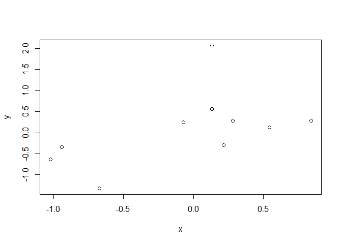

Getting started with simulating data in R: some helpful functions and
how to use them
================
Ariel Muldoon
August 28, 2018

# Overview

Here’s what we’ll talk about today:

1.  Simulate quantitative variables with `rnorm()` and `runif()`
2.  Generate character variables that represent groups via `rep()`.  
3.  Use `replicate()` to repeat the data simulation process many times

# Generating random numbers

An easy way to generate numeric data is to pull random numbers from some
distribution. The functions that do this in R always start with the
letter `r` (for “random”).

## `rnorm()` to generate random numbers from the normal distribution

Pull 5 random numbers from a standard normal distribution.

``` r
rnorm(5)
```

<<<<<<< HEAD
    ## [1] -0.02778368  0.79159119  0.41862278  0.15074969 -0.25006817
=======
    ## [1] -1.8959413  0.4220658 -1.1759058 -0.6294865 -0.7184541
>>>>>>> master

### Writing out arguments for clearer code

Using the defaults makes for quick coding but does not make the
parameters of the generating distribution clear.

``` r
rnorm(n = 5, mean = 0, sd = 1)
```

<<<<<<< HEAD
    ## [1] -0.06359233 -0.29952699  0.80254129  0.09682013 -0.82419265
=======
    ## [1] -0.4440400  0.8668020  0.2810383 -1.6856974  1.6429932
>>>>>>> master

### Setting the random seed for reproducible random numbers

To reproduce the random numbers, set the seed via `set.seed()`.

Set the seed and generate 5 numbers.

``` r
set.seed(16)
rnorm(n = 5, mean = 0, sd = 1)
```

    ## [1]  0.4764134 -0.1253800  1.0962162 -1.4442290  1.1478293

Reset the seed and we get the same 5 numbers.

``` r
set.seed(16)
rnorm(n = 5, mean = 0, sd = 1)
```

    ## [1]  0.4764134 -0.1253800  1.0962162 -1.4442290  1.1478293

### Change parameters in `rnorm()`

We can pull from different normal distributions by changing the
parameters.

First, using a mean of 0 and standard deviation of 2 (so a variance of
4).

``` r
rnorm(n = 5, mean = 0, sd = 2)
```

    ## [1] -0.9368241 -2.0119012  0.1271254  2.0499452  1.1462840

Using a large mean and relatively small standard deviation can give
values that are strictly positive.

``` r
rnorm(n = 5, mean = 50, sd = 20)
```

    ## [1] 86.94364 52.23867 35.07925 83.16427 64.43441

### Using vectors of values for the parameter arguments

Both `mean` and `sd` will take vectors of values.

Let’s pull 10 values from distributions with different means but the
same standard
    deviation.

``` r
rnorm(n = 10, mean = c(0, 5, 20), sd = 1)
```

    ##  [1] -1.6630805  5.5759095 20.4727601 -0.5427317  6.1276871 18.3522024
    ##  [7] -0.3141739  4.8173184 21.4704785 -0.8658988

We could pass a vector to `sd`, as well, but not `n`. The `n` argument
uses the length of the vector to indicate the number of values desired.

``` r
rnorm(n = c(2, 10, 10), mean = c(0, 5, 20), sd = c(1, 5, 20) )
```

    ## [1]  1.527467 10.270890 40.601420

## Example of using the simulated numbers from `rnorm()`

Exploring how related two unrelated vectors can appear.

``` r
x = rnorm(n = 10, mean = 0, sd = 1)
y = rnorm(n = 10, mean = 0, sd = 1)
plot(y ~ x)
```

<!-- -->

## `runif()` pulls from the uniform distribution

I like `runif()` to to generate continuous data within a set range.

The default is numbers between 0 and 1.

``` r
runif(n = 5, min = 0, max = 1)
```

    ## [1] 0.7153331 0.4503734 0.4639105 0.9781267 0.5911470

But we can do any range.

``` r
runif(n = 5, min = 50, max = 100)
```

    ## [1] 53.92200 88.71156 69.08552 90.30186 90.29624

## Example of using the simulated numbers from `runif()`

I like `runif()` to demonstrate how the relative size of the explanatory
variable affects the estimated coefficient.

Make a response variable via `rnorm()` and then generate an explanatory
variable between 1 and 2.

``` r
set.seed(16)
y = rnorm(n = 100, mean = 0, sd = 1)
x1 = runif(n = 100, min = 1, max = 2)
head(x1)
```

    ## [1] 1.957004 1.082791 1.710816 1.326998 1.995723 1.449522

Then make an explanatory variable between 200 and 300.

``` r
x2 = runif(n = 100, min = 200, max = 300)
head(x2)
```

    ## [1] 220.0617 263.4875 209.6036 245.3125 265.1869 257.4817

We’ll use the data in a regression model fit via `lm()`, making note of
the coefficients.

``` r
lm(y ~ x1 + x2)
```

    ## 
    ## Call:
    ## lm(formula = y ~ x1 + x2)
    ## 
    ## Coefficients:
    ## (Intercept)           x1           x2  
    ##    0.380887     0.104941    -0.001908

# Generate character vectors with `rep()`

Simulations involve categorical variables, as well, that often need to
be repeated in a pattern.

## Using `letters` and `LETTERS`

These are *built in constants* in R, and convenient for making a simple
character vectors.

The first two lowercase letters.

``` r
letters[1:2]
```

    ## [1] "a" "b"

The last 17 uppercase
    letters.

``` r
LETTERS[10:26]
```

    ##  [1] "J" "K" "L" "M" "N" "O" "P" "Q" "R" "S" "T" "U" "V" "W" "X" "Y" "Z"

## Repeat each element of a vector with `each`

With `each` we repeat each unique character in the vector some number of
times.

``` r
rep(letters[1:2], each = 3)
```

    ## [1] "a" "a" "a" "b" "b" "b"

## Repeat a whole vector with the `times` argument

Repeating is different with `times`.

``` r
rep(letters[1:2], times = 3)
```

    ## [1] "a" "b" "a" "b" "a" "b"

## Set the output vector length with the `length.out` argument

Using `length.out` is similar to `times` but the groups can be
imbalanced.

``` r
rep(letters[1:2], length.out = 5)
```

    ## [1] "a" "b" "a" "b" "a"

## Repeat each element a different number of `times`

We can get unbalanced data with `times` if we use a vector for the
argument.

``` r
rep(letters[1:2], times = c(2, 4) )
```

    ## [1] "a" "a" "b" "b" "b" "b"

## Combining `each` with `times`

When using `times` this way it will only take a single value and not a
vector.

``` r
rep(letters[1:2], each = 2, times = 3)
```

    ##  [1] "a" "a" "b" "b" "a" "a" "b" "b" "a" "a" "b" "b"

## Combining `each` with `length.out`

This is another way to impart imbalance.

``` r
rep(letters[1:2], each = 2, length.out = 7)
```

    ## [1] "a" "a" "b" "b" "a" "a" "b"

Note you can’t use `length.out` and `times` together (if you try,
`length.out` will be given priority and `times` ignored).

# Creating datasets with quantiative and categorical variables

## Simulate data with no differences among two groups

We want to simulate a two level grouping variable and a “response”
variable where there are no differences among the two groups.

``` r
group = rep(letters[1:2], each = 3)
response = rnorm(n = 6, mean = 0, sd = 1)
data.frame(group,
           response)
```

    ##   group   response
    ## 1     a -0.3645484
    ## 2     a  1.1666534
    ## 3     a -0.5193403
    ## 4     b  0.6411532
    ## 5     b -1.5328746
    ## 6     b  0.2288288

We don’t have to make each variable separately before putting in a
data.frame.

``` r
data.frame(group = rep(letters[1:2], each = 3),
           response = rnorm(n = 6, mean = 0, sd = 1) )
```

    ##   group   response
    ## 1     a -1.5902058
    ## 2     a -1.3377609
    ## 3     a  0.5683393
    ## 4     b  0.4983940
    ## 5     b  0.6961190
    ## 6     b -0.7421656

Now let’s add another categorical variable to this dataset that’s
*crossed* with the first.

The new factor will have three values.

``` r
LETTERS[3:5]
```

    ## [1] "C" "D" "E"

Remember the `group` factor is repeated elementwise.

``` r
rep(letters[1:2], each = 3)
```

    ## [1] "a" "a" "a" "b" "b" "b"

So what argument do we use for the new variable?

``` r
<<<<<<< HEAD
rep(LETTERS[3:5], ? = 2)
```

To repeat the whole vector twice we’ll need to use the `times` argument.
=======
rep(LETTERS[3:5], ?)
```

To repeat the whole vector twice can use the `times` argument or
`length.out = 6`.
>>>>>>> master

You can see that every level of this new variable occurs with every
level of `group`.

``` r
data.frame(group = rep(letters[1:2], each = 3),
           factor = rep(LETTERS[3:5], times = 2),
           response = rnorm(n = 6, mean = 0, sd = 1) )
```

    ##   group factor   response
    ## 1     a      C -0.4793688
    ## 2     a      D -0.1870510
    ## 3     a      E  1.2261275
    ## 4     b      C  0.4176968
    ## 5     b      D -0.7796569
    ## 6     b      E  1.0268540

What if we tried to use `each` instead?

``` r
data.frame(group = rep(letters[1:2], each = 3),
           factor = rep(LETTERS[3:5], each = 2),
           response = rnorm(n = 6, mean = 0, sd = 1) )
```

    ##   group factor   response
    ## 1     a      C  0.8224771
    ## 2     a      C  0.2760399
    ## 3     a      D  0.7461207
    ## 4     b      D -0.4273375
    ## 5     b      E  2.2141877
    ## 6     b      E  1.1332205

## Simulate data with a difference in means among two groups

We can use a vector for `mean` in `rnorm()` for this.

``` r
response = rnorm(n = 6, mean = c(5, 10), sd = 1)
response
```

    ## [1]  6.707689 10.458932  4.710911  9.619104  5.343241  9.630127

How do we get the `group` pattern correct?

``` r
<<<<<<< HEAD
group = rep(letters[1:2], ? = 3)
```

We need `times` again to repeat the whole vector three times to match
the output of `rnorm()`.

``` r
group = rep(letters[1:2], times = 3)
=======
group = rep(letters[1:2], ?)
```

We need `times` or `length.out` to repeat the whole vector to match the
output of `rnorm()`.

``` r
group = rep(letters[1:2], length.out = 6)
>>>>>>> master
group
```

    ## [1] "a" "b" "a" "b" "a" "b"

Getting the order correct is one reason to build vectors separately
before binding them into a data.frame.

``` r
data.frame(group,
            response)
```

    ##   group  response
    ## 1     a  6.707689
    ## 2     b 10.458932
    ## 3     a  4.710911
    ## 4     b  9.619104
    ## 5     a  5.343241
    ## 6     b  9.630127

# Repeatedly simulating data with `replicate()`

The `replicate()` function is a real workhorse when making repeated
simulations as it is for *repeated evaluation of an expression (which
<<<<<<< HEAD
will usually involves random number generation)*.
=======
will usually involve random number generation)*.
>>>>>>> master

It takes three arguments:

  - `n`, which is the number of replications to perform. This is to set
    the number of repeated runs we want.  
  - `expr`, the expression that should be run repeatedly. This is often
    a function.  
  - `simplify`, which controls the type of output the results of `expr`
<<<<<<< HEAD
    are saved into. Use `simplify = FALSE` to get vectors saved into a
=======
    are saved into. Use `simplify = FALSE` to get output saved into a
>>>>>>> master
    list instead of in an array.

## Simple example of `replicate()`

Generate 5 values from a standard normal distribution 3 times.

``` r
set.seed(16)
replicate(n = 3, 
          expr = rnorm(n = 5, mean = 0, sd = 1), 
          simplify = FALSE )
```

    ## [[1]]
    ## [1]  0.4764134 -0.1253800  1.0962162 -1.4442290  1.1478293
    ## 
    ## [[2]]
    ## [1] -0.46841204 -1.00595059  0.06356268  1.02497260  0.57314202
    ## 
    ## [[3]]
    ## [1]  1.8471821  0.1119334 -0.7460373  1.6582137  0.7217206

Without `simplify = FALSE` we get a matrix.

``` r
set.seed(16)
replicate(n = 3, 
          expr = rnorm(n = 5, mean = 0, sd = 1) )
```

    ##            [,1]        [,2]       [,3]
    ## [1,]  0.4764134 -0.46841204  1.8471821
    ## [2,] -0.1253800 -1.00595059  0.1119334
    ## [3,]  1.0962162  0.06356268 -0.7460373
    ## [4,] -1.4442290  1.02497260  1.6582137
    ## [5,]  1.1478293  0.57314202  0.7217206

## An equivalent `for()` loop example

The same thing can be done with a `for()` loop, which I’ve found can be
easier code to follow for R beginners.

``` r
set.seed(16)
list1 = list() # Make an empty list to save output in
for (i in 1:3) { # Indicate number of iterations with "i"
    list1[[i]] = rnorm(n = 5, mean = 0, sd = 1) # Save output in list for each iteration
}
list1
```

    ## [[1]]
    ## [1]  0.4764134 -0.1253800  1.0962162 -1.4442290  1.1478293
    ## 
    ## [[2]]
    ## [1] -0.46841204 -1.00595059  0.06356268  1.02497260  0.57314202
    ## 
    ## [[3]]
    ## [1]  1.8471821  0.1119334 -0.7460373  1.6582137  0.7217206

## Using `replicate()` to repeatedly make a dataset

<<<<<<< HEAD
Let’s replicate the “two groups with no difference in means” dataset
from earlier.

``` r
data.frame(group = rep(letters[1:2], each = 3),
           response = rnorm(n = 6, mean = 0, sd = 1) )
```

    ##   group   response
    ## 1     a -1.6630805
    ## 2     a  0.5759095
    ## 3     a  0.4727601
    ## 4     b -0.5427317
    ## 5     b  1.1276871
    ## 6     b -1.6477976

This can be put as the `expr` in `replicate()`.

=======
>>>>>>> master
``` r
simlist = replicate(n = 3, 
          expr = data.frame(group = rep(letters[1:2], each = 3),
                     response = rnorm(n = 6, mean = 0, sd = 1) ),
          simplify = FALSE)
```

We can see this result is a list of three data.frames.

``` r
str(simlist)
```

    ## List of 3
    ##  $ :'data.frame':    6 obs. of  2 variables:
    ##   ..$ group   : Factor w/ 2 levels "a","b": 1 1 1 2 2 2
<<<<<<< HEAD
    ##   ..$ response: num [1:6] -0.314 -0.183 1.47 -0.866 1.527 ...
    ##  $ :'data.frame':    6 obs. of  2 variables:
    ##   ..$ group   : Factor w/ 2 levels "a","b": 1 1 1 2 2 2
    ##   ..$ response: num [1:6] 1.03 0.84 0.217 -0.673 0.133 ...
    ##  $ :'data.frame':    6 obs. of  2 variables:
    ##   ..$ group   : Factor w/ 2 levels "a","b": 1 1 1 2 2 2
    ##   ..$ response: num [1:6] -0.943 -1.022 0.281 0.545 0.131 ...
=======
    ##   ..$ response: num [1:6] -1.663 0.576 0.473 -0.543 1.128 ...
    ##  $ :'data.frame':    6 obs. of  2 variables:
    ##   ..$ group   : Factor w/ 2 levels "a","b": 1 1 1 2 2 2
    ##   ..$ response: num [1:6] -0.314 -0.183 1.47 -0.866 1.527 ...
    ##  $ :'data.frame':    6 obs. of  2 variables:
    ##   ..$ group   : Factor w/ 2 levels "a","b": 1 1 1 2 2 2
    ##   ..$ response: num [1:6] 1.03 0.84 0.217 -0.673 0.133 ...
>>>>>>> master

Here is the first of the three.

``` r
simlist[[1]]
```

    ##   group   response
<<<<<<< HEAD
    ## 1     a -0.3141739
    ## 2     a -0.1826816
    ## 3     a  1.4704785
    ## 4     b -0.8658988
    ## 5     b  1.5274670
    ## 6     b  1.0541781
=======
    ## 1     a -1.6630805
    ## 2     a  0.5759095
    ## 3     a  0.4727601
    ## 4     b -0.5427317
    ## 5     b  1.1276871
    ## 6     b -1.6477976
>>>>>>> master

# What’s the next step?

By saving our generated variables or data.frames into a list we’ve made
it so we can loop via list looping functions like `lapply()` or
`purrr::map()`.

You can see a few examples of `replicate()` followed by `map()` in my
blog post [A closer look at replicate() and purrr::map() for
simulations](https://aosmith.rbind.io/2018/06/05/a-closer-look-at-replicate-and-purrr/).
